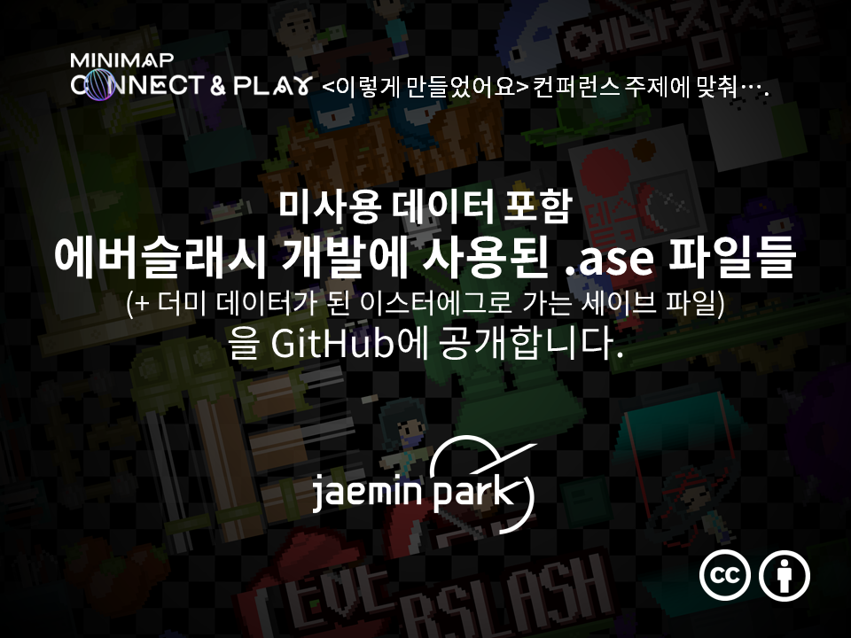

## 미사용 데이터 포함, 에버슬래시 개발에 사용된 .ase 파일들

옛날 컴퓨터 하드를 뒤지다 발견한, 미사용 데이터를 포함한 에버슬래시 개발에 사용 된 여러 리소스들이 들어있는 폴더입니다.

이 폴더는 에버슬래시 개발에 사용한 ase 파일들을 포함합니다. ase 파일은 픽셀 아트 편집 프로그램인 Aseprite가 사용하는 파일 포맷으로, 에버슬래시 개발 내내 스프라이트 관리를 위해 사용한 포맷입니다.

다만 몇몇 리소스는 Aseprite에서 작업하고 에버슬래시 프로젝트 폴더로 옮기는 대신 에버슬래시 프로젝트 폴더에 있는 png 파일을 직접 편집하는 방식으로 작업하여 ase 파일이 없는 경우도 있으며, 해당 리소스들은 결과적으로 이 폴더에서 찾을 수 없었습니다 - 요약해서, 에버슬래시의 모든 리소스(사용 데이터든, 미사용 데이터든)가 이
폴더에 들어 있는 것은 아닙니다.

그러나, 모든 사실에도 불구하고 여전히 너무나 많은 미사용 데이터를 담고 있어, 이들을 하드에 묵히고 있을 수는 없다고 판단했습니다. 미니맵 커넥트 & 플레이 컨퍼런스 발표와 함께, 발표 의의에 맞춰 이 자료들을 조심스레 공개해 봅니다.

(덧붙여서: 텀블벅 후원자 이스터에그를 위해 만든 리소스는 임의로 삭제했습니다. 그존재들은 후원자분들과의 작은 비밀로 남기고 싶습니다.)

2021년 11월 4일
박재민 올림

## 라이선스 정보

https://creativecommons.org/licenses/by/4.0/deed.ko

본 폴더의 자료들은 CC-BY 4.0 라이선스로 배포됩니다. 아래는 CC-BY 4.0 라이선스의
요약문입니다:

라이선스는 이용자에게 다음의 권리를 부여합니다:

* 공유 - 복제, 배포, 전시, 공연 및 공중송신 (포맷 변경도 포함)

* 변경 - 리믹스, 변형, 2차적 저작물의 작성

* 영리목적으로도 이용이 가능합니다.

이용자는 다음과 같은 조건을 따라야 합니다:

* 저작자표시 - 적절한 출처와 라이선스 링크를 표시하고, 변경이 있는 경우 공지해야
합니다. 어떤 방식으로든 합리적인 방법으로 표시하면 되지만, 이용 허락권자가 이용
자에게 권리를 부여하거나 이용자의 사용을 허가한다는 내용을 나타내서는 안됩니다.

* 추가제한금지 - 이용자는 이 라이선스로 허용된 행위를 제한하는 법적 조건이나 기
술적 조치를 부가해서는 안 됩니다.

면책 조항: 위 내용은 CC-BY 라이선스의 '요약문'으로써 라이선스 원문과 동등한 법적
효력을 갖지 않습니다. 라이선스 원문은 아래 링크에서 확인할 수 있습니다:

https://creativecommons.org/licenses/by/4.0/legalcode.ko

## ase 파일은 어떻게 열 수 있나요?

ase 파일들은 픽셀 아트 편집 프로그램 Aseprite를 이용해 열고 편집할 수 있습니다.
Aseprite는 Steam에서 구매 가능하며, 아래에 스팀 상점 페이지 링크를 남깁니다.

https://store.steampowered.com/app/431730/Aseprite/